# 🔄 AgentRelay

<div align="center">

**Secure Async Job Processing Architecture with Next.js, Supabase & Webhook Integration**

[](https://nextjs.org/)
[](https://react.dev/)
[](https://www.typescriptlang.org/)
[](https://supabase.com/)
[](https://tailwindcss.com/)

**A production-ready reference implementation for DevOps portfolios**

</div>

---

## 📋 Table of Contents

- [Project Overview](#-project-overview)
- [Screenshots](#-screenshots)
- [Key Features](#-key-features)
- [Architecture Patterns](#️-architecture-patterns)
- [Technology Stack](#️-technology-stack)
- [n8n Workflow Integration](#-n8n-workflow-integration-required)
- [Project Structure](#️-project-structure)
- [Getting Started](#-getting-started)
- [Security Implementation](#-security-implementation)
- [Development](#-development)
- [Use Cases](#-use-cases)

---

## 📋 Project Overview

**AgentRelay** is a reference architecture demonstrating enterprise-grade async job processing with secure webhook integration. This project showcases best practices for building scalable SaaS applications with Next.js, TypeScript, and Supabase.

### 🎯 What Does It Solve?

**Core Pattern Demonstrated:**
1. **Job Submission**: User creates a job via authenticated API
2. **Async Processing**: External service (webhook) processes the job
3. **Status Tracking**: Real-time status updates via Supabase subscriptions
4. **Result Display**: Secure result retrieval with Row Level Security (RLS)

### 🚀 Architecture Highlights

- **🔐 Security-First Design**: Demonstrates proper secret management, authentication, and authorization
- **📊 Real-time Updates**: WebSocket-based job status tracking using Supabase Realtime
- **🛡️ Row Level Security**: Database-level authorization ensuring data isolation
- **🔄 Webhook Integration**: Secure external service communication with HMAC validation
- **⚡ Async Job Pattern**: Scalable background processing architecture
- **🎨 Modern UI/UX**: Production-ready dashboard with responsive design

---

## 📸 Screenshots

### Landing Page


*Modern landing page with enterprise-grade design showcasing async job processing capabilities*

---

### Workflow Architecture


*Three-step workflow: Input & Collect → Analyze & Synthesize → Create & Publish*

---

### Authentication


*Secure email/password authentication with Supabase*

---

### Dashboard


*Job management dashboard with real-time status tracking*

---

### Job Analysis View


*Create new analysis jobs with topic and seed URL configuration*

---

## ✨ Key Features

### 🎨 **Enterprise UI/UX**
- **Professional Dashboard**: Job management with real-time status updates
- **Responsive Design**: Mobile-first, accessible interface
- **Modern Aesthetics**: Clean, minimalist design with Tailwind CSS 4

### 🔐 **Production-Grade Security**
- **Supabase Authentication**: Email/password with session management
- **API Route Protection**: Server-side auth validation
- **Webhook Secret Validation**: HMAC-based request verification
- **Environment Variable Management**: Secure configuration pattern
- **Row Level Security (RLS)**: Database-level access control

### 🤖 **Async Job Processing**
- **Job Queue Pattern**: Submit, track, and retrieve async operations
- **External Service Integration**: Webhook-based processing pipeline
- **Status Management**: Pending → Processing → Completed/Failed lifecycle
- **Real-time Notifications**: Live status updates without polling

### 🛠️ **Developer Experience**
- **TypeScript Throughout**: Full type safety across stack
- **Shared Type Definitions**: Centralized interfaces for consistency
- **API-First Architecture**: RESTful endpoints with proper error handling
- **Clean Code Structure**: Organized, maintainable codebase

---

## 🏛️ Architecture Patterns

### System Architecture

```mermaid
graph TD
    User([👤 User])
    Dashboard[💻 Next.js Dashboard]
    API[🛡️ API Routes]
    ExternalService[⚡ External Processor]
    Supabase[(🗄️ Supabase DB)]
    
    User -->|1. Submit Job| Dashboard
    Dashboard -->|2. POST /api/jobs| API
    API -->|3. Create Record| Supabase
    API -->|4. Trigger Webhook| ExternalService
    ExternalService -->|5. Process Data| ExternalService
    ExternalService -->|6. POST Results| API
    API -->|7. Update Record| Supabase
    Supabase -.->|8. Real-time Update| Dashboard
    
    classDef default fill:#f9f9f9,stroke:#333,stroke-width:1px;
    classDef next fill:#000,color:#fff,stroke:#333;
    classDef supabase fill:#3ECF8E,color:#fff,stroke:#333;
    classDef external fill:#FF6D5A,color:#fff,stroke:#333;
    
    class Dashboard,API next;
    class Supabase supabase;
    class ExternalService external;
```



### Security Flow

See [ARCHITECTURE_FLOW.md](./ARCHITECTURE_FLOW.md) for detailed security analysis and data flow documentation.

---

## 🛠️ Technology Stack

### Frontend
- **Next.js 16** - React Framework with App Router
- **React 19** - Latest with Server Components
- **TypeScript 5** - Type-safe development
- **Tailwind CSS 4** - Utility-first styling
- **Radix UI** - Accessible component primitives
- **Lucide React** - Icon library

### Backend & Database
- **Supabase** - Postgres, Auth, Realtime
- **PostgreSQL** - Relational database
- **Row Level Security** - Database-level authorization

### DevOps & Deployment
- **Vercel** - Edge deployment platform
- **GitHub Actions** - CI/CD (optional)
- **Environment Variables** - Secure configuration management

---

## 🔄 n8n Workflow Integration (REQUIRED)

### ⚠️ **Critical Component**

**AgentRelay requires an n8n workflow to function.** The workflow handles the async processing pipeline:

```
Next.js App → n8n Webhook → Apify Crawler → OpenAI → Supabase
```

### 📦 Included Files

1. **`n8n-workflow-backup.json`** - Sanitized workflow template (import to n8n)
2. **`N8N_WORKFLOW_GUIDE.md`** - Complete setup instructions
3. **`N8N_SECURITY_AUDIT.md`** - Security verification report

### 🚀 Quick Start

1. **Install n8n** (local or cloud)
   ```bash
   docker run -p 5678:5678 n8nio/n8n
   ```

2. **Import workflow**
   - Open n8n → Import `n8n-workflow-backup.json`

3. **Configure credentials**
   - Apify API key
   - OpenAI API key
   - Supabase service role key
   - Webhook secret (generate with `openssl rand -hex 32`)

4. **Update `.env.local`**
   ```env
   N8N_WEBHOOK_URL=https://your-n8n.com/webhook/agentrelay
   N8N_WEBHOOK_SECRET=your-secret-here
   ```

5. **Activate workflow** in n8n

### 📚 Documentation

See **[N8N_WORKFLOW_GUIDE.md](./N8N_WORKFLOW_GUIDE.md)** for:
- Detailed installation steps
- Credential configuration
- Testing procedures
- Troubleshooting guide

**Without this workflow, AgentRelay cannot process jobs!**

---

## 🏗️ Project Structure

```
AgentRelay/
├── app/
│   ├── api/                    # API Routes
│   │   ├── jobs/               # Job CRUD operations
│   │   └── webhooks/           # Webhook receivers
│   ├── auth/                   # Auth callbacks
│   ├── dashboard/              # Protected dashboard
│   ├── login/                  # Login page
│   ├── signup/                 # Signup page
│   ├── layout.tsx              # Root layout
│   └── page.tsx                # Landing page
├── components/
│   ├── auth/                   # Authentication components
│   ├── dashboard/              # Dashboard components
│   ├── landing/                # Landing page sections
│   └── ui/                     # Reusable UI components
├── lib/                        # Utilities
│   └── supabase/               # Supabase client
├── types/                      # TypeScript definitions
├── utils/                      # Helper functions
├── middleware.ts               # Route protection
├── .env.example                # Environment template
├── ARCHITECTURE_FLOW.md        # Security documentation
├── SECURITY_AUDIT.md           # Security best practices
└── README.md                   # This file
```

---

## 🚀 Getting Started

### Prerequisites

- **Node.js 18+**
- **Supabase Account** (free tier available)
- **External Webhook Service** (n8n, Zapier, or custom)

### Installation

#### 1. Clone Repository

```bash
git clone https://github.com/yourusername/agentrelay.git
cd agentrelay
npm install
```

#### 2. Environment Setup

Copy `.env.example` to `.env.local`:

```bash
cp .env.example .env.local
```

Update with your credentials:

```env
# Supabase (from Project Settings -> API)
NEXT_PUBLIC_SUPABASE_URL=https://your-project.supabase.co
NEXT_PUBLIC_SUPABASE_ANON_KEY=your-anon-key
SUPABASE_SERVICE_ROLE_KEY=your-service-role-key

# Webhook Configuration
N8N_WEBHOOK_URL=https://your-webhook-service.com/webhook/endpoint
N8N_WEBHOOK_SECRET=generate-secure-random-string

# App Config
NEXT_PUBLIC_APP_URL=http://localhost:3000
```

#### 3. Database Setup

Run the following SQL in your Supabase SQL Editor:

```sql
-- 1. Profiles Table
CREATE TABLE public.profiles (
  id UUID REFERENCES auth.users ON DELETE CASCADE NOT NULL PRIMARY KEY,
  email TEXT NOT NULL,
  created_at TIMESTAMPTZ DEFAULT now()
);
ALTER TABLE public.profiles ENABLE ROW LEVEL SECURITY;

-- 2. Jobs Table
CREATE TABLE public.jobs (
  id UUID DEFAULT gen_random_uuid() PRIMARY KEY,
  user_id UUID REFERENCES public.profiles(id) ON DELETE CASCADE NOT NULL,
  topic TEXT NOT NULL,
  input_config JSONB,
  status TEXT DEFAULT 'pending' CHECK (status IN ('pending', 'processing', 'completed', 'failed')),
  output JSONB,
  created_at TIMESTAMPTZ DEFAULT now(),
  updated_at TIMESTAMPTZ DEFAULT now()
);
ALTER TABLE public.jobs ENABLE ROW LEVEL SECURITY;

-- 3. RLS Policies
CREATE POLICY "Users view own profiles" 
  ON public.profiles FOR SELECT 
  USING (auth.uid() = id);

CREATE POLICY "Users view own jobs" 
  ON public.jobs FOR SELECT 
  USING (auth.uid() = user_id);

CREATE POLICY "Users create own jobs" 
  ON public.jobs FOR INSERT 
  WITH CHECK (auth.uid() = user_id);

CREATE POLICY "Users delete own jobs" 
  ON public.jobs FOR DELETE 
  USING (auth.uid() = user_id);

-- 4. Auto-create Profile Trigger
CREATE OR REPLACE FUNCTION public.handle_new_user()
RETURNS TRIGGER AS $$
BEGIN
  INSERT INTO public.profiles (id, email)
  VALUES (NEW.id, NEW.email);
  RETURN NEW;
END;
$$ LANGUAGE plpgsql SECURITY DEFINER;

CREATE TRIGGER on_auth_user_created
  AFTER INSERT ON auth.users
  FOR EACH ROW EXECUTE FUNCTION public.handle_new_user();
```

#### 4. Run Development Server

```bash
npm run dev
```

Visit [http://localhost:3000](http://localhost:3000)

---

## 🔐 Security Implementation

### Key Security Features

1. **No Direct Database Access from Browser**
   - All mutations go through authenticated API routes
   - Service role key only used server-side

2. **Webhook Secret Validation**
   - HMAC-based verification of external requests
   - Prevents unauthorized status updates

3. **Row Level Security (RLS)**
   - Database-level authorization
   - Users can only access their own data

4. **Environment Variable Management**
   - Secrets never committed to repository
   - `.env.example` for documentation only

5. **Session-Based Authentication**
   - Supabase Auth with HTTP-only cookies
   - Automatic session refresh

### Security Checklist

- ✅ Service role key never exposed to browser
- ✅ Webhook endpoints validate secrets
- ✅ RLS policies on all tables
- ✅ API routes require authentication
- ✅ Environment variables properly configured
- ✅ CORS configured for production domain

See [SECURITY_AUDIT.md](./SECURITY_AUDIT.md) for comprehensive security documentation.

---

## 🔧 Development

### Available Scripts

```bash
# Development server
npm run dev

# Type checking
npx tsc --noEmit

# Linting
npm run lint

# Production build
npm run build

# Start production server
npm start
```

### External Webhook Service Setup

This project requires an external service to process jobs. You can use:

- **n8n** (open-source workflow automation)
- **Zapier** (commercial automation platform)
- **Custom webhook service** (Node.js, Python, etc.)

**Required webhook response format:**

```json
{
  "job_id": "uuid",
  "status": "completed",
  "results": {
    // Your custom result data
  }
}
```

**Security headers required:**

```http
POST /api/webhooks/n8n
Content-Type: application/json
x-n8n-secret: your-webhook-secret
```

---

## 💼 Use Cases

This architecture pattern is suitable for:

- **AI/ML Processing Pipelines**: Submit requests, process asynchronously, display results
- **Data Transformation Jobs**: ETL operations with progress tracking
- **Report Generation**: Generate complex reports in background
- **Email Campaign Management**: Schedule and track bulk operations
- **API Integration Workflows**: Chain multiple external API calls
- **Content Processing**: Video transcoding, image optimization, etc.

---

## 📚 Additional Documentation

- [ARCHITECTURE_FLOW.md](./ARCHITECTURE_FLOW.md) - Detailed security flow analysis
- [SECURITY_AUDIT.md](./SECURITY_AUDIT.md) - Security best practices guide

---

## 🤝 Contributing

This is a reference architecture for educational purposes. Feel free to fork and adapt for your needs.

---

## 📄 License

MIT License - Feel free to use this in your portfolio or production projects.

---

## 🌟 Why This Architecture?

This project demonstrates:

- ✅ **Production-ready patterns** used in real SaaS applications
- ✅ **Security best practices** for webhook integrations
- ✅ **Scalable architecture** for async job processing
- ✅ **Modern tech stack** (Next.js 16, React 19, TypeScript 5)
- ✅ **Full-stack implementation** from database to UI
- ✅ **Real-world DevOps** deployment patterns

Perfect for:
- 🎯 **Portfolio projects** demonstrating enterprise skills
- 🎯 **Learning resource** for full-stack development
- 🎯 **Starting template** for SaaS applications
- 🎯 **Interview preparation** showcasing architecture knowledge

---

<div align="center">

**Built with ❤️ as a DevOps Portfolio Project for AstraOps. 
Implemented real project from this repo topicdigest.astraops.org**

[Architecture Docs](./ARCHITECTURE_FLOW.md) • [Security Guide](./SECURITY_AUDIT.md)

</div>
